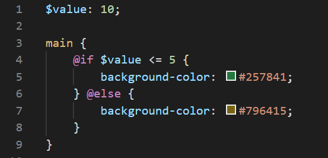
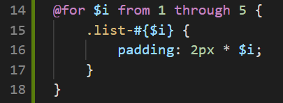
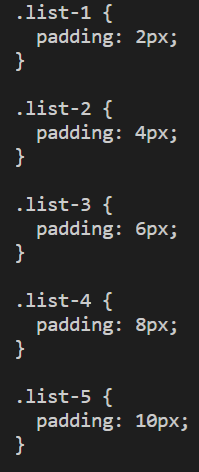
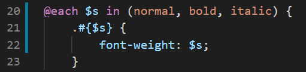

#### @if, @else, @for, @each
Ahogy eddig láthattuk, a CSS nem tartalmaz logikát, csak értékeket adunk a változóknak vele, és ezekkel formázzuk a html kódot.

Az SCSS ad nekünk olyan eszközöket, amelyek végigmennek bizonyos elemeket (ismételt vizsgálatot folytatnak) vagy választási lehetőséget nyújtanak.

Az scss fájlban is van lehetőségünk már ciklusok (@for / @each) írására és feltételek (@if / @else) kezelésére.

#### @if - @else

Ismerős lehet a kód, nézzük meg, hogy pontosan mi mit jelent.

- $value - létrehozunk egy változót, aminek az értékét fogjuk vizsgálni

- main {} - a main tagen belüli formázást állítjuk be

- **@if** - így határozzuk meg az if ágat, majd két paramétert adunk meg, közöttük relációs operátorral

- Itt a $value értékét vizsgáljuk meg, majd {} között az értékadás

- @else - az else ágat határozza meg, {} között pedig értéket adunk a propertynek.

#### @for
A for ciklus is a megszokott módon működik, ismétlődő műveletek elvégzéséhez használjuk.

A ciklust a **@for** kulcsszóval indítjuk el, majd létrehozunk egy konvencionálisan $i elnevezésű változót, amely az indexünk lesz.

Ez az index fogja a futás során változtatni az értékét, ezután meghatározzuk, hogy mettől meddig fusson le a ciklus - erre használjuk a **from** és a **through** kulcsszavakat.

- A for ciklus {} zárójelei között fogjuk meghatározni, hogy mit is csináljon a ciklus.

- .list- - list nevű osztályokat szeretnénk létrehozni

- #{$i} - interpolation alkalmazásával hozzáfűzzük a változó aktuális értékét

padding: értéket adunk a padding propertynek - a 2px konstans érték, ezt szorozzuk meg az $i változó aktuális értékével

És mindez a sima CSS fileban:

#### @Each
Az @Each vezérlési szerkezettel, ciklussal listákon tudunk végigmenni és így az elemeket felhasználni.

Nem meglepő módon az **@Each** kulcsszóval indítjuk a ciklust.

- $s - változót deklarálunk, amely minden körben megkapja az aktuális paraméter / list elem értékét

- in - ezt a kulcsszót követi a paraméter-lista, a megadott értékekkel

- () - zárójelek közé tesszük be a paramétereket - ide közvetlenül jöhetnek be az értékek, ahogy a példa is mutatja, de korábban létrehozott map vagy lista változóval is beírhatjuk

- {} - zárójelek között azt határozzuk meg, hogy mit végezzen el a ciklus

- .#{$} - ismét interpolation alkalmazásával létrehozzuk az adott lista/map elem felhasználásával az új osztályt

- font-weight - a lista elemét kapja a property értéknek
